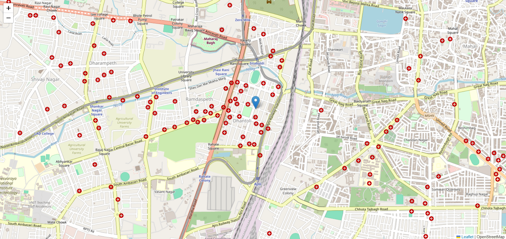
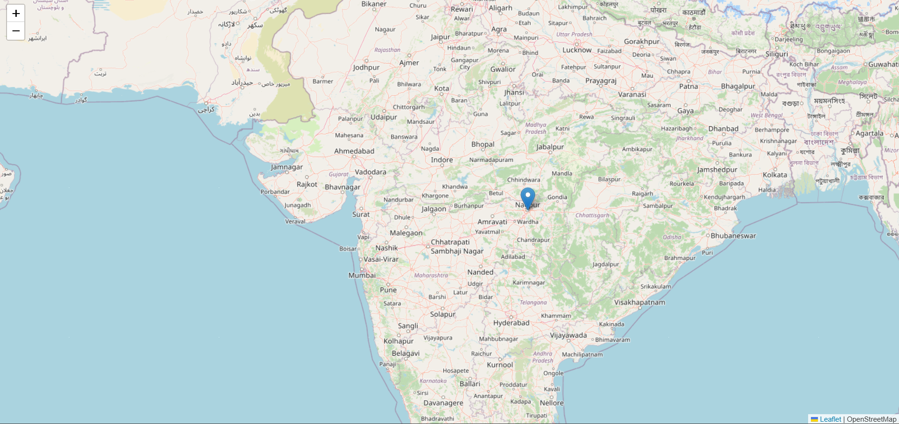

# Real-Time Location Tracking




## Overview

Welcome to the **Real-Time Tracking** project! This web application is designed for real-time location tracking and monitoring. It utilizes WebSocket technology to provide real-time updates, displaying the location of tracked entities on a map. All connected users can view everyone's location on the map in real-time.

## Features

- **Real-time Location Updates**: Uses WebSocket technology for instant location updates.
- **Interactive Map**: Displays locations on an interactive map using OpenStreetMap and Leaflet.js.
- **Multi-user Support**: Multiple connected users can view locations simultaneously.

## Technologies Used

- **JavaScript**: The programming language used for both client-side and server-side logic.
- **Node.js**: JavaScript runtime built on Chrome's V8 JavaScript engine.
- **Express.js**: A fast, unopinionated, minimalist web framework for Node.js.
- **Socket.IO**: Enables real-time, bidirectional communication between the server and clients.
- **OpenStreetMap**: Provides the map data.
- **Leaflet.js**: An open-source JavaScript library for mobile-friendly interactive maps.

## Installation

1. Clone the repository:
   ```bash
   git clone https://github.com/yourusername/realtime-location-tracker.git
   ```
2. Navigate to the project directory:
   ```bash
   cd realtime_location_tracker
   ```
3. Install the dependencies:
   ```bash
   npm install
   ```

## Usage

1. Start the server:
   ```bash
   node app.js
   ```
2. Open your web browser and go to `http://localhost:3000` to view the application.
